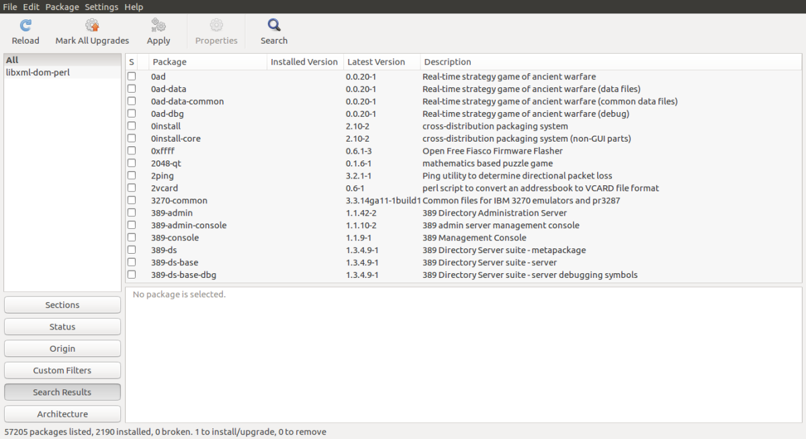
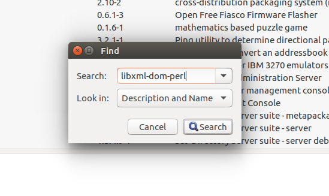
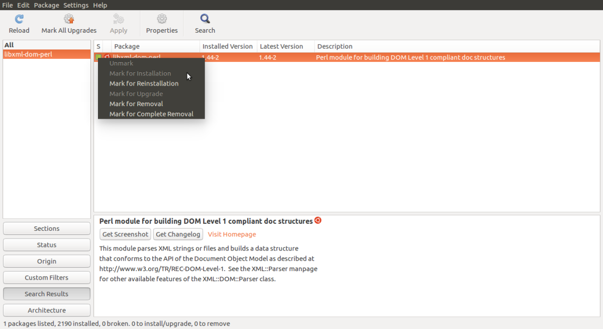

# How To Install Rouge (pyrouge) in Ubuntu 16.04

NB: To know about ROUGE check this [link](rouge.md)

## Installing Perl and Rouge

```
sudo apt-get install perl

```

* For installing XML:DOM(this is a requirement for ROUGE to work) we install synaptic package manager

```
sudo apt-get update
sudo apt-get install synaptic
```

* Once Synaptic Package manager is installed, search for Synaptic package manager in your applications and launch it.



* Once the package manager is opened search “libxml-dom-perl” 



* Click on Mark for Installation and apply changes.



* Download ROUGE-1.5.5 from [here](https://github.com/andersjo/pyrouge.git) You only need the ROUGE-1.5.5 directory. Do it in home directory.

```
git clone https://github.com/andersjo/pyrouge.git
cd pyrouge/tools/ROUGE-1.5.5

```

* An environment variable ROUGE_EVAL_HOME must be set to point to the data directory.

```
export ROUGE_EVAL_HOME="/home/sagor/pyrouge/tools/ROUGE-1.5.5/data/"
```

* To avoid any WordNet exceptions, run these commands.

```
cd data/WordNet-2.0-Exceptions/
./buildExeptionDB.pl . exc WordNet-2.0.exc.db

cd ../
ln -s WordNet-2.0-Exceptions/WordNet-2.0.exc.db WordNet-2.0.exc.db
```

Rouge Installing has doen. !

## Setting up pyrouge

* Clone the pyrouge git and working directory

```
git clone https://github.com/bheinzerling/pyrouge.git
cd pyrouge
```

* Install pyrouge using


```
python setup.py install
```

* Set the ROUGE path with the command

```
pyrouge_set_rouge_path /home/sagor/pyrouge/tools/ROUGE-1.5.5/
```

* To verify , pyrouge install successfully or not

```
python -m pyrouge.test

```

if it show the output like below, then it's done to install pyrouge

```
Ran 10 tests in 18.055s

OK
```

if it's showing failed then [this](https://github.com/bheinzerling/pyrouge/issues/8) issues eduOS answer might solve this problem.

* If Failed:

```
cd pyrouge/tools/ROUGE-1.5.5/data
rm WordNet-2.0.exc.db
./WordNet-2.0-Exceptions/buildExeptionDB.pl ./WordNet-2.0-Exceptions ./smart_common_words.txt ./WordNet-2.0.exc.db

```


## References
1. [https://poojithansl7.wordpress.com/2018/08/04/setting-up-rouge/](https://poojithansl7.wordpress.com/2018/08/04/setting-up-rouge/)
2. [http://kavita-ganesan.com/rouge-howto/](http://kavita-ganesan.com/rouge-howto/)
3. [https://stackoverflow.com/questions/28941839/how-to-install-rouge-in-ubuntu/28941840#28941840](https://stackoverflow.com/questions/28941839/how-to-install-rouge-in-ubuntu/28941840#28941840)

