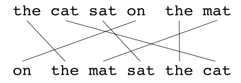
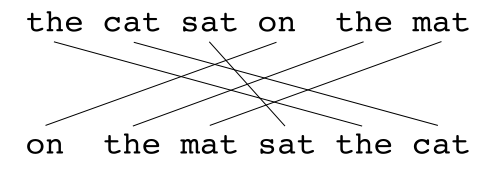

# METEOR (Metric for Evaluation of Translation with Explicit ORdering)
METEOR  is a metric for the evaluation of machine translation output. The metric is based on the harmonic mean of unigram precision and recall, with recall weighted higher than precision. 

Meteor consists of two major components:
`a flexible monolingual word aligner` and `a scorer`

## Example 

## References
1. [https://en.wikipedia.org/wiki/METEOR](https://en.wikipedia.org/wiki/METEOR)
2. [https://medium.com/explorations-in-language-and-learning/metrics-for-nlg-evaluation-c89b6a781054](https://medium.com/explorations-in-language-and-learning/metrics-for-nlg-evaluation-c89b6a781054)
