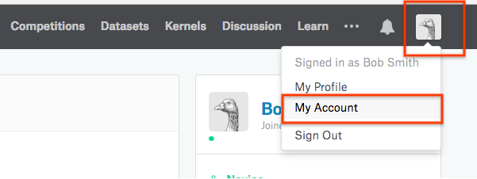
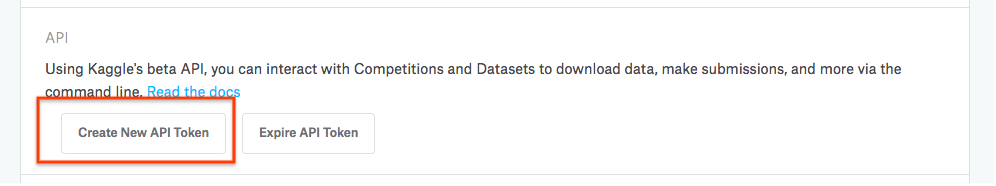

## _Kaggle Section:_ Creating Kaggle API

* To do this, go to [kaggle.com/](kaggle.com/) and open your user settings page.


* Next, scroll down to the API access section and click generate to download an API key.



This will download a file called kaggle.json to your computer. You'll use this file in Colab to access Kaggle datasets and competitions.

## _Colab Section:_ Accessing kaggle data in Colab

* Navigate to [https://colab.research.google.com/.]()

* **Upload your kaggle.json file using the following snippet in a code cell:**


```py
# Run this cell and select the kaggle.json file downloaded
# from the Kaggle account settings page.
from google.colab import files
files.upload()
```


* **Let's make sure the kaggle.json file is present.**


```py
# Let's make sure the kaggle.json file is present.
!ls -lha kaggle.json
```

    -rw-r--r-- 1 root root 64 Jun  1 20:46 kaggle.json


* **Install Kaggle API client**


```py
# Next, install the Kaggle API client.
!pip install -q kaggle
```


```py
# The Kaggle API client expects this file to be in ~/.kaggle,
# so move it there.
!mkdir -p ~/.kaggle
!cp kaggle.json ~/.kaggle/

# This permissions change avoids a warning on Kaggle tool startup.
!chmod 600 ~/.kaggle/kaggle.json
```

* **List of available datasets**


```py
# List available datasets.
!kaggle datasets list
```

* **Copy or Download Datasets locally**


```py
# Copy the stackoverflow data set locally.
!kaggle datasets download -d stackoverflow/stack-overflow-2018-developer-survey
```

    


```
!head ~/.kaggle/datasets/stackoverflow/stack-overflow-2018-developer-survey/survey_results_public.csv
```


## References
* [https://stackoverflow.com/questions/49310470/using-kaggle-datasets-in-google-colab](https://stackoverflow.com/questions/49310470/using-kaggle-datasets-in-google-colab)
* [Colab Notebook](https://colab.research.google.com/drive/1DofKEdQYaXmDWBzuResXWWvxhLgDeVyl)
