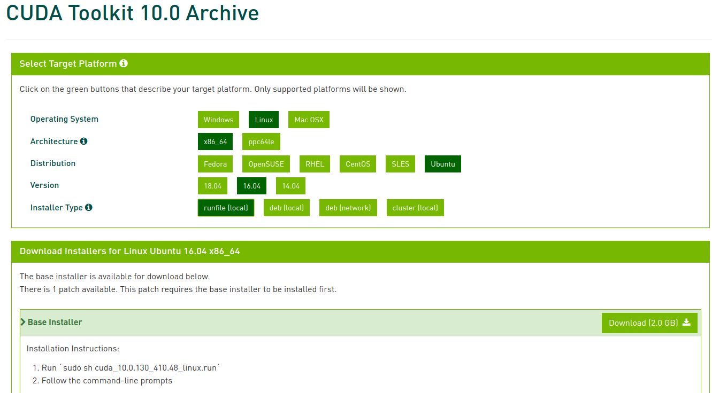

# Using Multiple Cuda in ubuntu 16.04

You are using cuda 9.0 and want to use cuda 10.0 also. 
Don't worry. Follow these steps.

**NB: It's working fine in my pc. I am not responsible for any kind of *RISK*.**

## Install cuda 10.0
* Download cuda 10.0 from [nvidia](https://developer.nvidia.com/cuda-10.0-download-archive?target_os=Linux&target_arch=x86_64&target_distro=Ubuntu&target_version=1604&target_type=runfilelocal)



* Install
    ```
    cd Downloads
    sudo sh cuda-10.0.run --silent --toolkit --toolkitpath=/usr/local/cuda-10.0

    ```

**Here**
- `--silent` this will force installer to do everything in a silent mode without any interactive prompt. Really useful for the automation
- `--toolkit` — install only the toolkit, majority of users probably indeed need only toolkit
- `--toolkitpath` — this is where all the magic starts, each cuda that we’re going to install needs to be installed in its own separate folder, in our example CUDA9 is installed in /usr/local/cuda-9.0, therefore CUDA10 will be installed in /usr/local/cuda-10, CUDA9.1 can go to /usr/local/cuda-9.1 , etc


## Activate cuda 10.0
inside `/usr/local` open terminal and remove `cuda` link

`sudo rm -rf cuda`

* create new cuda link
`sudo ln -s cuda-10.0 cuda`

It's done. Now use cuda 10.0

## Going back to cuda 9.0
inside `/usr/local` open terminal and remove cuda link

`sudo rm -rf cuda`

* create new cuda link
`sudo ln -s cuda-9.0 cuda`


# References
[https://blog.kovalevskyi.com/multiple-version-of-cuda-libraries-on-the-same-machine-b9502d50ae77](https://blog.kovalevskyi.com/multiple-version-of-cuda-libraries-on-the-same-machine-b9502d50ae77)