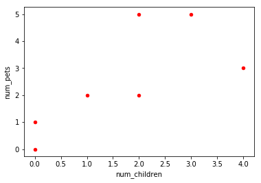
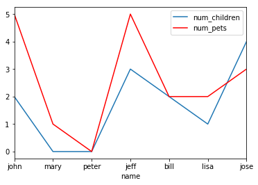
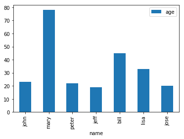
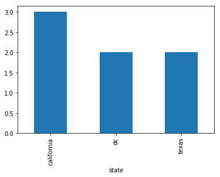
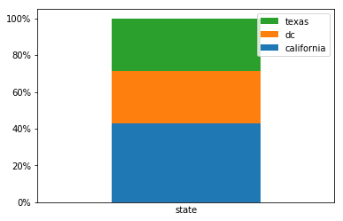

# *Pandas Dataframe: Plot Examples with Matplotlib and Pyplot*

## Sample pandas dataframe for examples


```py
import pandas as pd

df = pd.DataFrame({
    'name':['john','mary','peter','jeff','bill','lisa','jose'],
    'age':[23,78,22,19,45,33,20],
    'gender':['M','F','M','M','M','F','M'],
    'state':['california','dc','california','dc','california','texas','texas'],
    'num_children':[2,0,0,3,2,1,4],
    'num_pets':[5,1,0,5,2,2,3]
})

df
```


<div>
<style scoped>
    .dataframe tbody tr th:only-of-type {
        vertical-align: middle;
    }

    .dataframe tbody tr th {
        vertical-align: top;
    }

    .dataframe thead th {
        text-align: right;
    }
</style>
<table border="1" class="dataframe">
  <thead>
    <tr style="text-align: right;">
      <th></th>
      <th>name</th>
      <th>age</th>
      <th>gender</th>
      <th>state</th>
      <th>num_children</th>
      <th>num_pets</th>
    </tr>
  </thead>
  <tbody>
    <tr>
      <th>0</th>
      <td>john</td>
      <td>23</td>
      <td>M</td>
      <td>california</td>
      <td>2</td>
      <td>5</td>
    </tr>
    <tr>
      <th>1</th>
      <td>mary</td>
      <td>78</td>
      <td>F</td>
      <td>dc</td>
      <td>0</td>
      <td>1</td>
    </tr>
    <tr>
      <th>2</th>
      <td>peter</td>
      <td>22</td>
      <td>M</td>
      <td>california</td>
      <td>0</td>
      <td>0</td>
    </tr>
    <tr>
      <th>3</th>
      <td>jeff</td>
      <td>19</td>
      <td>M</td>
      <td>dc</td>
      <td>3</td>
      <td>5</td>
    </tr>
    <tr>
      <th>4</th>
      <td>bill</td>
      <td>45</td>
      <td>M</td>
      <td>california</td>
      <td>2</td>
      <td>2</td>
    </tr>
    <tr>
      <th>5</th>
      <td>lisa</td>
      <td>33</td>
      <td>F</td>
      <td>texas</td>
      <td>1</td>
      <td>2</td>
    </tr>
    <tr>
      <th>6</th>
      <td>jose</td>
      <td>20</td>
      <td>M</td>
      <td>texas</td>
      <td>4</td>
      <td>3</td>
    </tr>
  </tbody>
</table>
</div>


## Plot two dataframe columns as a scatter plot


```py
import matplotlib.pyplot as plt
import pandas as pd

# a scatter plot comparing num_children and num_pets
df.plot(kind='scatter',x='num_children',y='num_pets',color='red')
plt.show()
```





## Plot column values as a bar plot


```py
import matplotlib.pyplot as plt
import pandas as pd

# a simple line plot
df.plot(kind='bar',x='name',y='age')
```


    <matplotlib.axes._subplots.AxesSubplot at 0x7f4534eb3780>


## Line plot with multiple columns


```py
import matplotlib.pyplot as plt
import pandas as pd

# gca stands for 'get current axis'
ax = plt.gca()

df.plot(kind='line',x='name',y='num_children',ax=ax)
df.plot(kind='line',x='name',y='num_pets', color='red', ax=ax)

plt.show()
```





## Save plot to file


```py
import matplotlib.pyplot as plt
import pandas as pd

df.plot(kind='bar',x='name',y='age')

# the plot gets saved to 'output.png'
plt.savefig('output.png')
```





## Bar plot with group by


```py
import matplotlib.pyplot as plt
import pandas as pd

df.groupby('state')['name'].nunique().plot(kind='bar')
plt.show()
```





## Stacked bar plot with group by, normalized to 100%


```py
import matplotlib.pyplot as plt
import matplotlib.ticker as mtick

# create dummy variable them group by that
# set the legend to false because we'll fix it later
df.assign(
 dummy = 1   
).groupby(['dummy','state']).size().groupby(level=0).apply(
    lambda x: 100 * x / x.sum()
).to_frame().unstack().plot(kind='bar',stacked=True,legend=False)

# or it'll show up as 'dummy' 
plt.xlabel('state')

# disable ticks in the x axis
plt.xticks([])

# fix the legend or it'll include the dummy variable
current_handles, _ = plt.gca().get_legend_handles_labels()
reversed_handles = reversed(current_handles)
correct_labels = reversed(df['state'].unique())

plt.legend(reversed_handles,correct_labels)

plt.gca().yaxis.set_major_formatter(mtick.PercentFormatter())
plt.show()
```





## References

[http://queirozf.com/entries/pandas-dataframe-plot-examples-with-matplotlib-pyplot](http://queirozf.com/entries/pandas-dataframe-plot-examples-with-matplotlib-pyplot)
